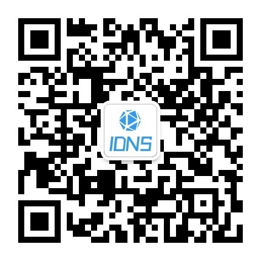

# rrai-wx

## 软软 AI 小程序代码
这可以说是写的第一个小程序，别嫌弃。

软软 AI 的一些功能
- 实现了调用 OpenAI 的接口实现智能的问题
- 调用AIGC 的接口实现图片的生成
- 可以交流提示词
- 以及会员、积分、一些小工具

### 软软 AI 小程序
> 可以扫码下边的二维码进行体验。（由于 openAI 的接口限制，问答功能微信内不可用）

### 软软公众账号

# 后端

> 后端使用的腾讯云，如果有需要的可以联系我（QQ:52289930）

# 如对您有帮助，欢迎支持一下

